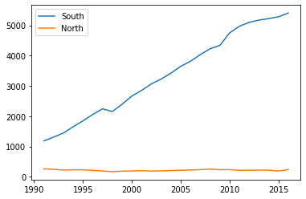
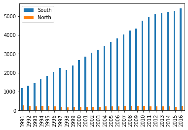
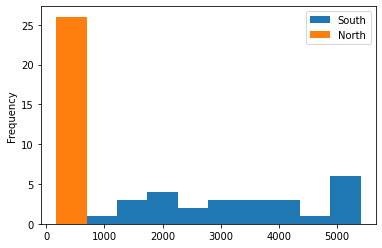
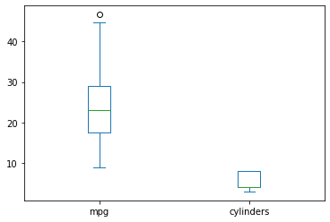
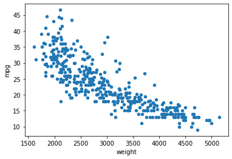
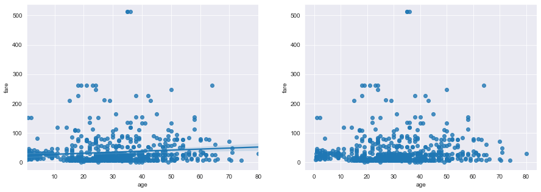
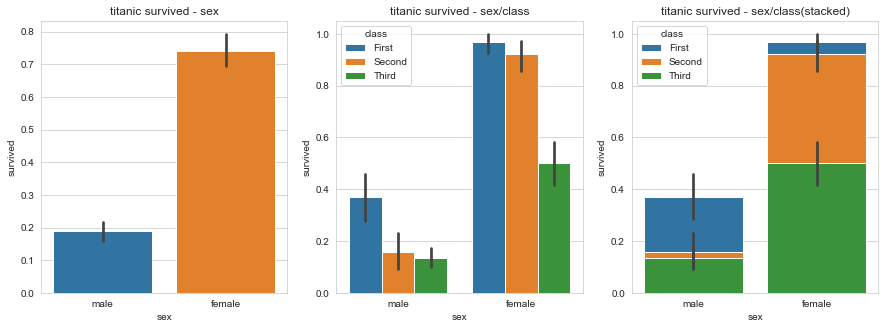

교육 제목: 판다스

교육 일시: 2021 - 09 - 30

교육장소: 영우글로벌러닝

# 교육내용

## Python 관련

```python
# %load 파일명.py  -> 해당 파일의 코드를 불러온다. 
# import, 폰트 설정등 자주 사용하는 세팅을 불러오는 데 유용하다. 
%load a.py
```

## Pandas 관련

```python
#DataFrame 에서 NaN(누락값) 을 처리하는 방법
# methond = 'ffill' 은 앞 데이터(엑셀 양식 병합 부분)로 채운다는 의미
df = df.fillna(method = 'ffill')
```

```python
# Series 를 mask 를 사용해서 필터링 하는 방법
# 서울에서 다른 지역으로 이동한 데이터만 추출하여 정리
mask = (df['전출지별'] == '서울특별시') & (df['전입지별'] != '서울특별시') 
df_seoul = df[mask]
```


## 데이터 살펴보기

### 1. 데이터 프레임의 구조

 1. #### 데이터 내용 미리보기

    `~~.head(n)`

    `~~.tail(n)`

    ```python
    df = pd.read_csv('./auto-mpg.csv', header = None)
    df.columns = ['mpg', 'cylinders', 'displacement', 
                 'horsepower', 'weight', 'acceleration',
                 'model_year', 'origin','name']
    
    print(df.head(3))
    print("\n")
    print(df.tail())
    ```

    ```
     mpg  cylinders  displacement horsepower  weight  acceleration  model_year  \
    0  18.0          8         307.0      130.0  3504.0          12.0          70   
    1  15.0          8         350.0      165.0  3693.0          11.5          70   
    2  18.0          8         318.0      150.0  3436.0          11.0          70   
    
       origin                       name  
    0       1  chevrolet chevelle malibu  
    1       1          buick skylark 320  
    2       1         plymouth satellite  
    
    
          mpg  cylinders  displacement horsepower  weight  acceleration  \
    393  27.0          4         140.0      86.00  2790.0          15.6   
    394  44.0          4          97.0      52.00  2130.0          24.6   
    395  32.0          4         135.0      84.00  2295.0          11.6   
    396  28.0          4         120.0      79.00  2625.0          18.6   
    397  31.0          4         119.0      82.00  2720.0          19.4   
    
         model_year  origin             name  
    393          82       1  ford mustang gl  
    394          82       2        vw pickup  
    395          82       1    dodge rampage  
    396          82       1      ford ranger  
    397          82       1       chevy s-10  
    ```

 2. #### 데이터 요약 정보 확인하기

    `~~.shape`

    ```python
    df.shape # 데이터프레임의 행과 열의 갯수를 보여줌
    ```

    ```
    (398, 9)
    ```

    `~~.info()`

    ```python
    df.info()
    ```

    ```
    <class 'pandas.core.frame.DataFrame'>
    RangeIndex: 398 entries, 0 to 397
    Data columns (total 9 columns):
     #   Column        Non-Null Count  Dtype  
    ---  ------        --------------  -----  
     0   mpg           398 non-null    float64
     1   cylinders     398 non-null    int64  
     2   displacement  398 non-null    float64
     3   horsepower    398 non-null    object 
     4   weight        398 non-null    float64
     5   acceleration  398 non-null    float64
     6   model_year    398 non-null    int64  
     7   origin        398 non-null    int64  
     8   name          398 non-null    object 
    dtypes: float64(4), int64(3), object(2)
    memory usage: 28.1+ KB
    ```

    `~~.describe`

    ```python
    print(df.describe()) #df.describe() : return data type : DataFrame
    df_desc = df.describe().loc[['count', 'std'], ['mpg', 'weight']]
    df_desc
    ```

    ```
                  mpg   cylinders  displacement       weight  acceleration  \
    count  398.000000  398.000000    398.000000   398.000000    398.000000   
    mean    23.514573    5.454774    193.425879  2970.424623     15.568090   
    std      7.815984    1.701004    104.269838   846.841774      2.757689   
    min      9.000000    3.000000     68.000000  1613.000000      8.000000   
    25%     17.500000    4.000000    104.250000  2223.750000     13.825000   
    50%     23.000000    4.000000    148.500000  2803.500000     15.500000   
    75%     29.000000    8.000000    262.000000  3608.000000     17.175000   
    max     46.600000    8.000000    455.000000  5140.000000     24.800000   
    
           model_year      origin  
    count  398.000000  398.000000  
    mean    76.010050    1.572864  
    std      3.697627    0.802055  
    min     70.000000    1.000000  
    25%     73.000000    1.000000  
    50%     76.000000    1.000000  
    75%     79.000000    2.000000  
    max     82.000000    3.000000  
    ```

    |       |        mpg |     weight |
    | ----: | ---------: | ---------: |
    | count | 398.000000 | 398.000000 |
    |   std |   7.815984 | 846.841774 |

 3. #### 데이터 개수 확인하기

    `~~.count()`

    `~~["열 이름"].value_counts()`

    ```python
    df['origin'].value_counts()
    ```

    ```
    1    249
    3     79
    2     70
    Name: origin, dtype: int64
    ```

### 2. 통계 함수 적용

1. 평균값(mean value)

   `~~.mean()` 

   `~~["열 이름"].mean()`

2. 중간값(median value)

   `~~.median()`

   `~~["열 이름"].median()`

3. 최대값(max value)

   `~~.max()`

   `~~["열 이름"].max()`

4. 최소값(mean value)

   `~~.min()`

   `~~["열 이름"].min()`

5. 표준편차(standard deviation)

   `~~.std()`

   `~~["열 이름"].std()`

6. 상관계수(correlation)

   `~~.corr()`

   `~~[열 이름의 리스트].corr()`

   ```python
   # 평균값  df.mean() : 전체 컬럼들의 평균
   # df["컬럼명"] : 해당 컬럼의 평균 
   # mean, median, min, max, std, corr 을 각각 구해보세요
   
   print("mean : ", df["mpg"].mean())
   print("median : ", df["mpg"].median())
   print("min : ", df["mpg"].min())
   print("max : ", df["mpg"].max())
   print("std : ", df["mpg"].std())
   print("corr : \n", df[["mpg", "cylinders"]].corr())
   ```

   ```
   mean :  23.514572864321615
   median :  23.0
   min :  9.0
   max :  46.6
   std :  7.815984312565782
   corr : 
                    mpg  cylinders
   mpg        1.000000  -0.775396
   cylinders -0.775396   1.000000
   ```
   
   ### 3. 판다스 내장 그래프 도구 활용

https://pandas.pydata.org/docs/reference/api/pandas.DataFrame.plot.html

`~~.plot(kind = '그래프 종류')`

- ‘line’ : line plot (default)
- ‘bar’ : vertical bar plot
- ‘barh’ : horizontal bar plot
- ‘hist’ : histogram
- ‘box’ : boxplot
- ‘kde’ : Kernel Density Estimation plot
- ‘density’ : same as ‘kde’
- ‘area’ : area plot
- ‘pie’ : pie plot
- ‘scatter’ : scatter plot (DataFrame only)
- ‘hexbin’ : hexbin plot (DataFrame only)

```python
df_ns_t = df_ns.T  # 데이터프레임의 행과 열을 바꿈
df_ns_t.plot(kind='line')
df_ns_t.plot(kind='bar')
df_ns_t.plot(kind='hist')

df_mpg = pd.read_csv("./auto-mpg.csv", header=None)
df_mpg.columns = ['mpg','cylinders','displacement',
             'horsepower','weight', 'acceleration',
             'model_year','origin','name']

df_mpg[['mpg','cylinders']].plot(kind='box')
df_mpg.plot(x="weight", y="mpg", kind="scatter")
```











## Matplotlib

기본적인 사용방법은 위에서 언급한  방법과 같음

```python
# import 방법
import matplotlib.pyplot as plt 
```

```python
#한글 폰트 문제
plt.rcParams['font.family'] = 'Malgun Gothic' # 윈도우 기본 폰트
plt.rcParams['font.family'] = 'AppleGothic'  # 애플 기본 폰트
```

```python
# 스타일 설정
plt.stype.use('ggplot')
```

https://matplotlib.org/stable/gallery/style_sheets/ggplot.html

ggplot 스타일 관련 설명

https://matplotlib.org/stable/tutorials/introductory/customizing.html

스타일 customizing 관련 설명


## Seaborn

설명은 고급 그래프 도구라고 하는데

matplotlib 이랑 다른 방식의 그래프 툴이다. 

```python
import seaborn as sns
 
# Seaborn 제공 데이터셋 가져오기
titanic = sns.load_dataset('titanic')
 
# 스타일 테마 설정 (5가지: darkgrid, whitegrid, dark, white, ticks)
sns.set_style('darkgrid')

# 그래프 객체 생성 (figure에 2개의 서브 플롯을 생성)
fig = plt.figure(figsize=(15, 5))   
ax1 = fig.add_subplot(1, 2, 1)
ax2 = fig.add_subplot(1, 2, 2)
 
# 그래프 그리기 - 선형회귀선 표시(fit_reg=True)
sns.regplot(x='age',        #x축 변수
            y='fare',       #y축 변수
            data=titanic,   #데이터
            ax=ax1)         #axe 객체 - 1번째 그래프 

# 그래프 그리기 - 선형회귀선 미표시(fit_reg=False)
sns.regplot(x='age',        #x축 변수
            y='fare',       #y축 변수
            data=titanic,   #데이터
            ax=ax2,         #axe 객체 - 2번째 그래프        
            fit_reg=False)  #회귀선 미표시

plt.show()
```



```python
# 라이브러리 불러오기
import matplotlib.pyplot as plt
import seaborn as sns
 
# Seaborn 제공 데이터셋 가져오기
titanic = sns.load_dataset('titanic')
 
# 스타일 테마 설정 (5가지: darkgrid, whitegrid, dark, white, ticks)
sns.set_style('whitegrid')

# 그래프 객체 생성 (figure에 3개의 서브 플롯을 생성)
fig = plt.figure(figsize=(15, 5))   
ax1 = fig.add_subplot(1, 3, 1)
ax2 = fig.add_subplot(1, 3, 2)
ax3 = fig.add_subplot(1, 3, 3)
 
# x축, y축에 변수 할당
sns.barplot(x='sex', y='survived', data=titanic, ax=ax1) 

# x축, y축에 변수 할당하고 hue 옵션 추가 
sns.barplot(x='sex', y='survived', hue='class', data=titanic, ax=ax2) 

# x축, y축에 변수 할당하고 hue 옵션을 추가하여 누적 출력
sns.barplot(x='sex', y='survived', hue='class', dodge=False, data=titanic, ax=ax3)       

# 차트 제목 표시
ax1.set_title('titanic survived - sex')
ax2.set_title('titanic survived - sex/class')
ax3.set_title('titanic survived - sex/class(stacked)')

plt.show()
```




## Folium

```python
# 라이브러리 불러오기
import folium

# 서울 지도 만들기
seoul_map = folium.Map(location=[37.55,126.98], zoom_start=12)

# 지도를 HTML 파일로 저장하기
seoul_map.save('./seoul.html')
```

```python
# 라이브러리 불러오기
import pandas as pd
import folium

# 대학교 리스트를 데이터프레임 변환
df = pd.read_excel('./서울지역 대학교 위치.xlsx', engine= 'openpyxl')

# 서울 지도 만들기
seoul_map = folium.Map(location=[37.55,126.98], tiles='Stamen Terrain', 
                        zoom_start=12)

# 대학교 위치정보를 Marker로 표시
for name, lat, lng in zip(df.index, df.위도, df.경도):
    folium.Marker([lat, lng], popup=name).add_to(seoul_map)

# 지도를 HTML 파일로 저장하기
seoul_map.save('./seoul_colleges.html')
```


