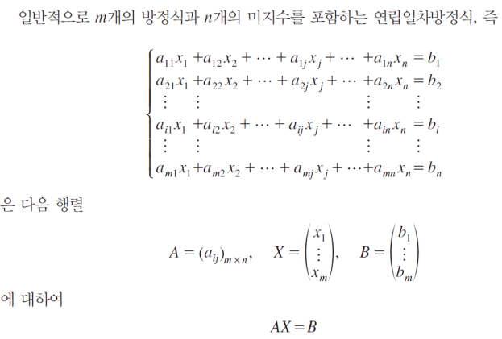
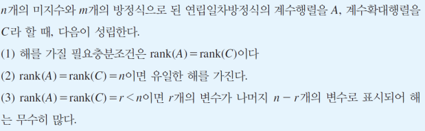
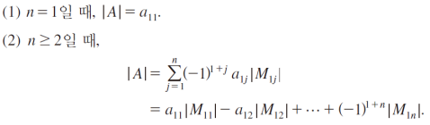

 교육 제목: 머신러닝 기초(행렬)

교육 일시: 2021 - 10 - 06

교육장소: 영우글로벌러닝

# 교육내용

## 행렬

#### 행렬의 배열

​	수나 문자를 직사각형 모양으로 배열하여 (    ) 또는 [    ]로 묶은 것을 **행렬(Matrix)**이라 하고, 
배열의 가로줄을 **행**(**Row**), 배열의 새로줄을 **열**(**column**)이라 한다. 

##### 정방행렬(Square Matrix)

​	행과 열의 크기가 같은 행렬

##### 영행렬(Zero Matrix)

​	행렬의 모든 원소가 0으로 이루어진 행렬

##### 대각행렬(Diagonal Matrix)

​	행렬의 대각(행 = 열 인 위치) 를 제외한 모든 원소가 0으로 이루어진 행렬
​	Square Matrix 만 가능하다. 

##### 단위행렬(Identity Matrix)

​	행렬의 대각 원소가 모두 1로 되어있고, 나머지 원소는 모두 0으로 되어있는 행렬
​	Square Matrix만 가능하다. 

##### 전치행렬(Transpose Matrix)

​	행과 열의 원소의 위치를 바꾼 행렬 
​	At 형태로 사용한다. 

#### 상등 (`= `)

​	행과 열의 크기가 같은 두 행렬의 모든 요소가 같다면 `같다`라고 하고 `A = B`형태로 표시

#### 상수 곱

​	행렬 `A`에 대한 상수 `r`의 곱
​		rA = (raij) 

#### 행렬의 합과 차

​		행렬 A, B에 대하여
​		A + B = (aij + bij)
​		A - B = A + (-1)B

#### 행렬연산의 성질

 

#### 행렬의 곱

 

#### 행렬의 결합법칙과 분배법칙

 

#### 연립일차방정식

 

#### 행제형

  1. 각 행의 선두요소는 1

  2. 위 행의 선도요소는 다음 행의 선두요소보다 앞선다. 

#### 기약행제형(Reduced row Echelm Form)

  1. 행제형을 만족한다. 
  2. 각 행의 선두요소(1) 위, 아래 행은 모두 0

#### 특정 행렬을 행제형 / 기약행제형 으로 만들때 가능한 것

- 두 행을 교환한다. 
- 한 행에 0이 아닌 상수를 곱한다. 
- 한행에 임의의 상수를 곱하여 다른 행에 더한다. 

#### 계수확대행렬(Augmented Matrix)

https://en.wikipedia.org/wiki/Augmented_matrix

- (일단은) 연립방정식을 행렬로 표기 할때 쓰기 좋은 형태
- 가우스 소거법, 가우스-조단 소거법 을 사용할때 자주 쓴다. 
-   형태로 표현한다. 
  (이때 A는 계수행렬이다.)

#### 가우스(Gauss) 소거법(elimination)

1. 연립일차방정식을 계수확대 행렬 형태로 변환한다. 
2. 계수확대 행렬의 앞부분의 행제형을 구한다. 

#### 가우스-조단(Gauss-Jordan) 소거법(elimination)

- 가우스 소거법에서 기약행제형까지 구하면 된다. 

#### 행렬의 위수(Rank)

- 행렬 A를 행제형으로 나타내었을 때, 행의 모든 요소가 0이 아닌 행의 수

- `rank(A)` 형태로 사용

  ##### 성질(연립일차방정식의 해가 어떠한 형태로 있는지 확인할때 사용한다.)

 

### 

#### 소행렬(Minor maxtrix)

- 주어진 정방행렬 A에서 *i*행과 *j*열을 제거하고 남은 행렬을 ***ij*-소행렬**(minor matrix) 라고 한다. 
- M*ij*(A) 또는 간단히 M*ij* 로 표현

#### 행렬식(Determinant)

- n 정방행렬 A = (a*ij*) 에 대하여
- |A| ,   det(A) 라고 표현

- 다음 정의에 대응하는 실수

   

 

##### 행렬식의 성질

 

#### 역행렬(inverse matrix) 

 

#### 역행렬과 연립방정식의 해

#### 여인수(Cofactor)

 

#### 크래머(Cramer) 법칙

