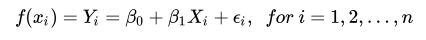
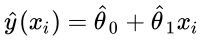
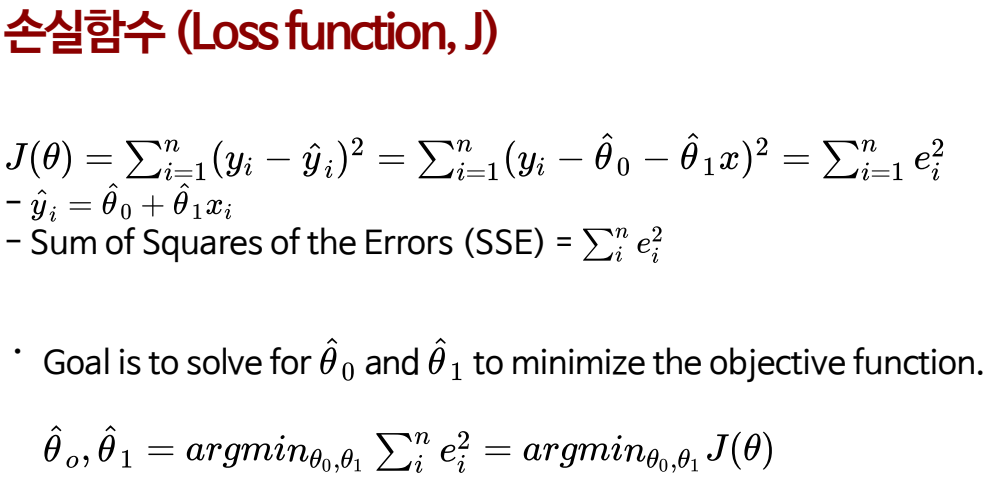
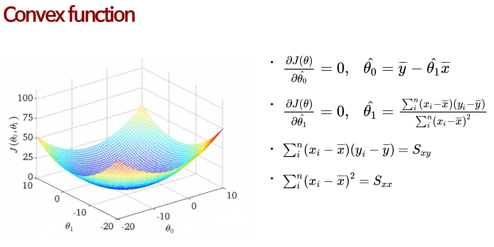

교육 제목: 선형회귀

교육 일시: 2021 - 10 - 13

교육장소: 영우글로벌러닝

# 교육내용

## 선형회귀(Linear Regression)

- 지도학습
- 목적변수 (반응변수)가 연속형인 경우
- 정규성, 독립성, 등분산성을 만족해야 함
- Feature 가 하나인 경우 단순(Simple), 
  Feature 가 여러 개 인 경우 중회귀(Multiple)
- 2차항 이상이 포함된 경우 다항회귀(Polynomial regression)

### 단순회귀(Simple linear regression)

​	

### 최소 제곱 추정량 (Ordinary least square estimation)

​	

```python
def abline(slope, intercept):
    """Plot a line from slope and intercept"""
    axes = plt.gca()
    x_vals = np.array(axes.get_xlim())
    y_vals = intercept + slope * x_vals
    plt.plot(x_vals, y_vals, '--')
```

```python
# x, y 난수 생성
import numpy as np
import pandas as pd
import matplotlib.pyplot as plt

np.random.seed(1013)

x = np.arange(1,30,1,dtype = np.int16)

y = 2*x + 1

y_random = y + np.random.normal(loc = 0, scale  =8, size = 29)
```

```python
# 직접 단순 회귀 구함
                               
Sxy = (x - np.mean(x)) * (y_random - np.mean(y_random))
Sxx = (x - np.mean(x)) ** 2

Sxy = Sxy.sum()
Sxx = Sxx.sum()

beta_1 = Sxy / Sxx
beta_0 = np.mean(y_random) - beta_1 * np.mean(x) 

#plt.plot(x,y,".",markersize = 20)
plt.plot(x,y_random, ".", markersize = 20)
abline(beta_1, beta_0)
plt.show()
```

```python
## sklearn import 해서 자체 함수로 단순 회귀 구하기
from sklearn.linear_model import LinearRegression

lr = LinearRegression()
x_2d = x.reshape(-1,1)
lr.fit(x_2d, y_random)

print(lr.coef_, lr.intercept_)

plt.plot(x,y_random, ".", markersize = 20)
abline(lr.coef_, lr.intercept_)
plt.show()
```







## 머신러닝이란

1. 학습이란?
2. Image classificatoin
3. 가슴 X-ray diagnosis
4. 기계학습의 분류
5. 준지도 학습
6. 머신러닝 수업 진행
   - ML 전처리
   - ML 알고리즘

## 모델링 과정

1. Traning set and test set
2. 일반적인 ML 예측 과정
3. ML 모델의 치우침(Bias) 과 분산(variance)
4. Traning set 과 Testing set 분할
5. 기계학습 모델 평가
   - k-fold 교차 검증
