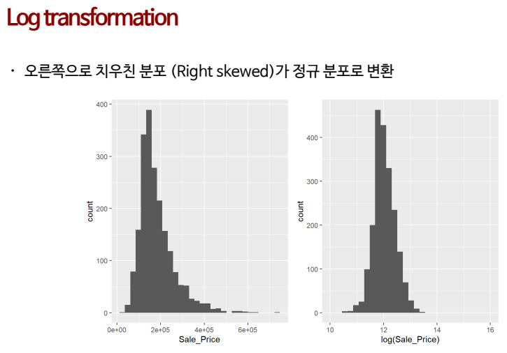
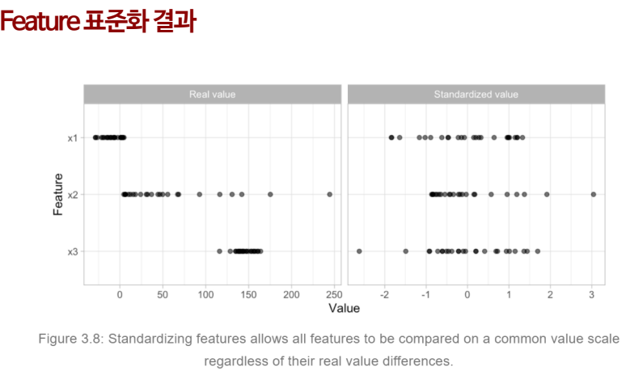
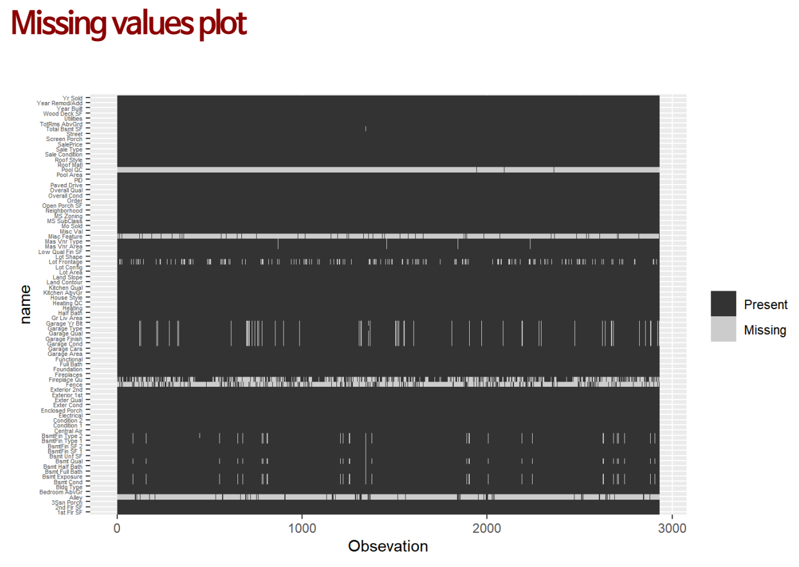
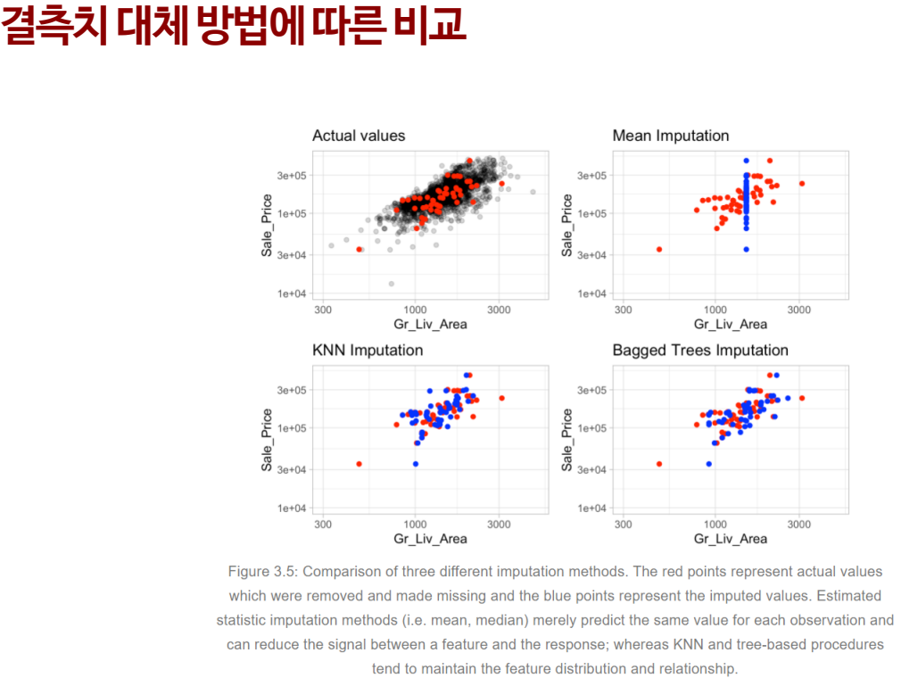
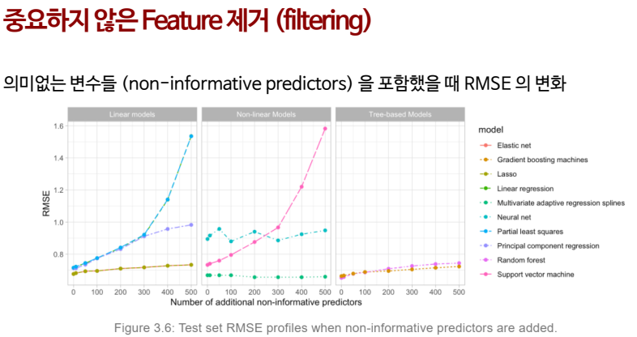
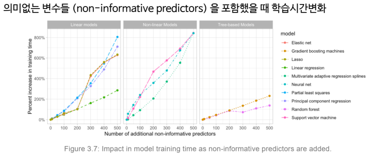

교육 제목: 

교육 일시: 2021 - 

교육장소: 영우글로벌러닝

# 교육내용

## 모델링 과정

1. Traning set and test set

2. 일반적인 ML 예측 과정

3. ML 모델의 치우침(Bias) 과 분산(variance)

4. Traning set 과 Testing set 분할

5. 기계학습 모델 평가

   - k-fold 교차 검증
   - Bootstrapping

6. 초매개변수 조절(Hyperparameter tuning)

   - 초매개변수는 학습 과정을 제어하는 데 사용되는 매개 변수를 의미
   - 초매개변수는 모델 학습과정이 아닌 모델 개발자에 의해서 지정됨

7. KNN( K-nearest neighbors) classification

8. 기하학적 거리(Geometric distance measures)

9. 초매개변수 조절을 위한 격자탐색(Grid search) 알고리즘

10. 반응변수 전처리(Target engineering)

    - 주로 parametric model 에서 예측 및 모델 적용을 위해 사용
    - e.g. Gaussian distribution, Oridnary linear regression

    

11. Feature 표준화(Standardization)

    - 각 각 feature 의 측정 단위에 대한 보정
      - 예) 아파트 값을 추정하기 위한 feature들 중 평수(30평) 와 주변지역의 땅값(3,000,000 / 평)
    - Centering and scaling 을 통해서 평균이 0, 표준편차가 1이 되도록 변환 해 줌 

https://bradleyboehmke.github.io/HOML

12. 결측치(missing data)
    - 무작위 결측치(Random missing value)
      - 완전 무작위 결측치(MCAR: missing completely at random)
        - 예) 단순한 결측치
      - 무작위 결측치(MAR : Missing At Random)
        - 예) 여성(X1)의 경우 체중(X2)에 대한 답이 없음
      - 비무작위 결측치(NMAR : Not Missing At Random)
        - 예) 체중(X2) 무거운 사람은 체중(X2)에 대한 답이 없음
    - 결측치 대체(imputation)
      - 결측치를 "최상의 추측"값으로 대체
      - Estimated statistic (e.g. , Mean, Median, Mode, Regression)
      - KNN
      - Tree-Based

https://bradleyboehmke.github.io/HOML

